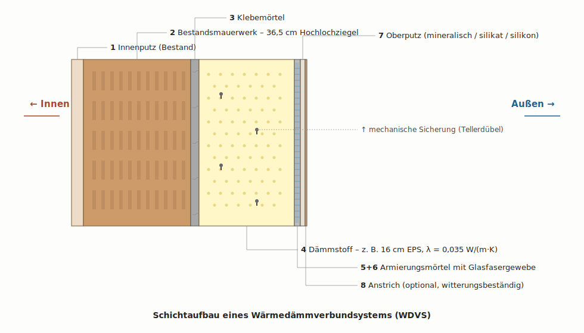

# WDVS – das System

Ein **Wärmedämmverbundsystem (WDVS)** ist ein außenseitig auf die Bestandsfassade aufgebrachtes, mehrschichtiges Dämmsystem. Im Unterschied zu Einzelmaterialien handelt es sich um ein **bauaufsichtlich zugelassenes Gesamtsystem**, dessen Komponenten genau aufeinander abgestimmt sein müssen.

!!! abstract "Lernziele"
    Nach diesem Kapitel könnt ihr
    
    - den Schichtaufbau eines WDVS benennen und skizzieren,
    - die Funktion jeder Schicht erklären,
    - den Unterschied zwischen einem System und einer Einzelmaßnahme verstehen,
    - die Vorteile eines außen liegenden Dämmsystems gegenüber Innendämmung benennen.

## Schichtaufbau

{ width="900" }

Von innen nach außen besteht ein WDVS aus folgenden Schichten:

| Nr. | Schicht | Funktion | typische Dicke |
|---|---|---|---|
| 1 | Innenputz (Bestand) | bleibt erhalten | 1–2 cm |
| 2 | Bestandsmauerwerk | Tragwerk, bleibt erhalten | 24–36,5 cm |
| 3 | Klebemörtel | Verbindung zur Wand | 0,5–1 cm |
| 4 | Dämmstoff | reduziert Wärmedurchgang (Hauptfunktion) | 12–24 cm |
| 5 | Armierungsmörtel | trägt das Gewebe | 4–6 mm |
| 6 | Armierungsgewebe | nimmt Spannungen auf, verhindert Risse | – |
| 7 | Oberputz | Witterungsschutz, Optik | 2–4 mm |
| 8 | Anstrich (optional) | zusätzlicher Witterungsschutz, Farbe | – |

Zusätzlich werden je nach Statik **Tellerdübel** durch die Dämmplatten ins Mauerwerk gesetzt, um die Platten mechanisch zu sichern.

## Was bedeutet "System"?

WDVS-Komponenten dürfen **nicht beliebig miteinander kombiniert** werden. Jeder Hersteller bietet ein **System mit allgemeiner bauaufsichtlicher Zulassung (abZ)** an, das genau aus seinen Komponenten besteht. Klebemörtel von Hersteller A mit Dämmplatten von Hersteller B und Oberputz von Hersteller C zu kombinieren ist nicht erlaubt – und wäre auch fachlich riskant, weil die Komponenten nicht aufeinander getestet sind.

!!! warning "Praxis-Hinweis"
    Bei der Sanierungsberatung wird **immer ein konkretes System** ausgewählt und ausgeschrieben. Spätere Reparaturen oder Erweiterungen erfolgen mit Komponenten desselben Systems.

## Warum WDVS außen und nicht innen?

Eine Dämmung kann grundsätzlich auch innen angebracht werden. Praktisch hat die **Außendämmung als WDVS** aber entscheidende Vorteile:

| Kriterium | WDVS (außen) | Innendämmung |
|---|---|---|
| Wohnfläche | bleibt erhalten | reduziert sich |
| Wärmebrücken | werden mit überdämmt | bleiben oft kritisch |
| Bauphysik (Tauwasser) | unkritisch | anspruchsvoll, Glaserverfahren nötig |
| Speichermasse der Wand | bleibt nutzbar (innen warm) | wird abgeschnitten |
| Eingriff in Bewohner-Alltag | gering, von außen | hoch, jeder Raum betroffen |
| Kosten pro m² | mittel | je nach Lösung höher |
| Denkmalschutz | oft Ausschlusskriterium | eine der wenigen Optionen |

Für ein freistehendes EFH wie das der Schmitts ohne Denkmalschutz ist das WDVS die **klare Standardlösung**.

## Funktion der einzelnen Schichten

**Klebemörtel** verbindet die Dämmplatten mit dem tragfähigen Untergrund. Bei ebenen Untergründen wird vollflächig verklebt, bei unebenen Untergründen im **Punkt-Wulst-Verfahren** (Mörtel als Wulst am Plattenrand plus mehrere Punkte in der Plattenmitte). Mindestens 40 % der Plattenrückseite müssen Kontakt zur Wand haben.

**Der Dämmstoff** ist die eigentliche Funktionsschicht des Systems. Hier entsteht der Großteil des Wärmedurchlasswiderstandes. Welche Dämmstoffe es gibt und wie sie sich unterscheiden, lernt ihr im Kapitel [Materialien](wdvs-materialien.md).

**Tellerdübel** sichern die Dämmplatten zusätzlich mechanisch. Die Anzahl pro m² (typisch 6–8) richtet sich nach Gebäudehöhe, Windlast und Plattengewicht.

**Armierungsmörtel mit Glasfasergewebe** ist die mechanische Schutzschicht: Das Gewebe nimmt Spannungen aus der thermischen Längenänderung auf und verhindert Rissbildung. Ohne Armierung würde der Oberputz durch Hitze und Frost reißen.

**Oberputz** schützt das System vor Wasser, UV-Strahlung und mechanischer Beanspruchung. Übliche Bindemittel sind mineralisch (Kalk-Zement), silikatisch (Wasserglas), silikonharzbasiert oder kunstharzgebunden – jedes mit eigenen Eigenschaften bezüglich Diffusion, Verarbeitbarkeit und Algenresistenz.

## Was leistet ein WDVS?

Wir haben es im Kapitel [U-Wert berechnen](../berechnungen/u-wert-bauteil.md) gerade nachgerechnet: Mit 16 cm EPS-WDVS sinkt der U-Wert der Außenwand bei den Schmitts von 0,92 auf 0,18 W/(m²·K) – eine Reduktion auf knapp **ein Fünftel des Bestandswerts**. Über die gesamte Außenwandfläche von 152 m² bedeutet das eine Heizleistungs-Einsparung von rund 2,3 kW an einem typischen Wintertag.

## Verständnis-Check

Welche Schicht eines WDVS leistet den Hauptbeitrag zur Wärmedämmung?

<ul class="quiz__opts">
<li>Klebemörtel und Armierungsmörtel zusammen</li>
<li>Der Oberputz mit der Strukturierung</li>
<li>Der Dämmstoff (z. B. EPS oder Mineralwolle)</li>
<li>Das Glasfasergewebe in der Armierung</li>
</ul>

Der <strong>Dämmstoff</strong> trägt mit seinem niedrigen λ-Wert (typisch 0,032–0,040) und einer Dicke von 12–24 cm den allergrößten Teil zum Gesamtwiderstand bei. Bei den Schmitts haben wir gesehen: Die 16-cm-EPS-Schicht stellt allein etwa 4,57 m²·K/W bereit – über 80 % des Gesamtwiderstandes der sanierten Wand.

Warum dürfen Komponenten verschiedener WDVS-Hersteller nicht miteinander kombiniert werden?

<ul class="quiz__opts">
<li>Wegen des Markenrechts der Hersteller.</li>
<li>Weil die bauaufsichtliche Zulassung (abZ) immer für ein konkretes System gilt und nur die geprüften Komponenten umfasst.</li>
<li>Weil verschiedene Hersteller unterschiedliche Maße verwenden und es technisch nicht zusammenpassen würde.</li>
<li>Weil die Garantieansprüche gegenüber den Herstellern dann verloren gehen würden – aus rein juristischen Gründen.</li>
</ul>

Die <strong>allgemeine bauaufsichtliche Zulassung</strong> wird für das Gesamtsystem aus aufeinander abgestimmten Komponenten erteilt. Eine Mischung mit Komponenten anderer Hersteller verlässt diese Zulassung – das Bauteil ist dann formal nicht mehr regelkonform und Schäden sind nicht mehr abgesichert.

Welcher entscheidende Vorteil spricht für ein WDVS gegenüber einer Innendämmung?

<ul class="quiz__opts">
<li>Wärmebrücken werden mit überdämmt und die Wohnfläche bleibt erhalten.</li>
<li>WDVS ist immer günstiger pro Quadratmeter als jede Innendämmung.</li>
<li>WDVS funktioniert auch ohne Dampfbremse, Innendämmung dagegen nie.</li>
<li>Eine Innendämmung darf in NRW nicht angebracht werden.</li>
</ul>

Die <strong>außenliegende Dämmung umschließt das gesamte Mauerwerk</strong>, sodass typische Wärmebrücken (z. B. Heizkörpernischen, Rollladenkästen) automatisch mit überdämmt werden. Außerdem geht keine Wohnfläche verloren. Innendämmung ist bauphysikalisch deutlich anspruchsvoller und meist die Notlösung – z. B. bei denkmalgeschützten Fassaden.

Welche Funktion hat das Glasfasergewebe in der Armierungsschicht?

<ul class="quiz__opts">
<li>Es verbessert die Wärmeleitung gleichmäßig in alle Richtungen.</li>
<li>Es nimmt thermische Spannungen auf und verhindert Risse im Putz.</li>
<li>Es dient zur Befestigung der Dämmplatten am Mauerwerk.</li>
<li>Es ersetzt die Verdübelung bei großen Plattenformaten.</li>
</ul>

Sonneneinstrahlung und Frost führen zu Längenänderungen des Putzes. Das <strong>Glasfasergewebe</strong> nimmt diese Spannungen auf und verteilt sie gleichmäßig – ohne das Gewebe würde der Putz reißen. Verdübelung übernehmen die Tellerdübel, Befestigung am Mauerwerk macht der Klebemörtel.

In welcher Situation wäre eine Innendämmung tatsächlich die richtige Wahl?

<ul class="quiz__opts">
<li>Bei einem Mietshaus, weil dann die Mieter weniger gestört werden.</li>
<li>Wenn der Bauherr besonders günstig sanieren möchte.</li>
<li>Bei denkmalgeschützten Fassaden, deren äußere Optik erhalten werden muss.</li>
<li>Bei sehr dünnen Außenwänden – dort ist WDVS technisch nicht zulässig.</li>
</ul>

Bei <strong>Denkmalschutz oder gestalterisch wichtigen Sichtfassaden</strong> bleibt nur die Innendämmung. Sie ist anspruchsvoller in der Ausführung (Tauwasserrisiko, Wärmebrücken, Verlust an Wohnfläche), aber sie ändert die äußere Erscheinung des Gebäudes nicht.

Welche Aussage zu Tellerdübeln im WDVS ist richtig?

<ul class="quiz__opts">
<li>Sie sind grundsätzlich verboten, weil sie als Wärmebrücken wirken.</li>
<li>Sie sichern die Dämmplatten zusätzlich mechanisch; Anzahl und Anordnung richten sich nach Gebäudehöhe und Windlast.</li>
<li>Sie übernehmen die Hauptbefestigung der Platten – der Klebemörtel ist nur eine Hilfe für den Anpressdruck.</li>
<li>Sie werden ausschließlich am Sockel und an den Hausecken eingesetzt.</li>
</ul>

Die <strong>Hauptbefestigung übernimmt der Klebemörtel</strong>, die Tellerdübel sind die <strong>mechanische Sicherung</strong>. Typisch sind 6–8 Dübel pro m². Mehr werden bei höheren Gebäuden oder windexponierten Lagen gesetzt. Moderne Tellerdübel mit Dämmstoff-Rondelle reduzieren die Wärmebrückenwirkung auf ein vernachlässigbares Maß.

## Im Unterricht besprechen

Reflexion

Stell dir vor, ihr lasst selbst ein WDVS am eigenen Haus anbringen. Worauf würdet ihr beim Auftragnehmer und bei der Ausführung besonders achten – auch wenn ihr selbst nicht jeden Tag auf der Baustelle stehen könnt?

Diskussion

Es gibt eine kontroverse öffentliche Debatte zum Brandschutz von EPS-WDVS. Auslöser waren u.&nbsp;a. der Hochhausbrand in London (Grenfell Tower 2017) und einzelne Fassadenbrände in Deutschland. Welche Argumente hört ihr in der Praxis pro Mineralwolle (A-Klasse, nichtbrennbar) gegenüber EPS (E/B1, schwer entflammbar)? Wo hört die berechtigte Sorge auf, wo beginnt die nicht ausreichend differenzierte Risikoeinschätzung?

Recherche-Anregung: Was sind die Anforderungen an Brandriegel im EPS-WDVS bei Wohngebäuden vs. Hochhäusern? Wie häufig sind Fassadenbrände bei EFH-WDVS in der Statistik?

Diskussion

Ein häufig gehörter Kritikpunkt am WDVS: „<em>Die Häuser werden alle gleich verspargelt – mit dicken Styropor-Paketen verlieren sie ihren Charakter.</em>" Wo liegen die ästhetischen und stadtbildlichen Grenzen einer flächendeckenden WDVS-Sanierung? Welche Gestaltungsoptionen haben Bauherrinnen und Bauherren trotzdem (Putzstrukturen, Farben, Klinker-Anmutung, Holzverkleidungen, vorgehängte Fassaden)?

## Worüber wir später sprechen

In dieser Doppelstunde haben wir das System grundsätzlich verstanden und seinen Effekt berechnet. Vertiefen werden wir in den nächsten Stunden:

- **Materialien** im Detail: Welcher Dämmstoff für welche Situation? → [WDVS Materialien](wdvs-materialien.md)
- **Ausführung**: Wie wird ein WDVS Schritt für Schritt angebracht? → [WDVS Ausführung](wdvs-ausfuehrung.md)
- **Konstruktive Details**: Sockel, Fensterlaibungen, Dachanschluss → [WDVS Details](wdvs-details.md)
- **Wirtschaftlichkeit**: Kosten, Förderung, Amortisation → [Amortisation](../wirtschaft-oekologie/amortisation.md)
- **Ökologische Bewertung**: graue Energie, CO₂-Bilanz → [CO₂-Bilanz](../wirtschaft-oekologie/co2-bilanz.md)
