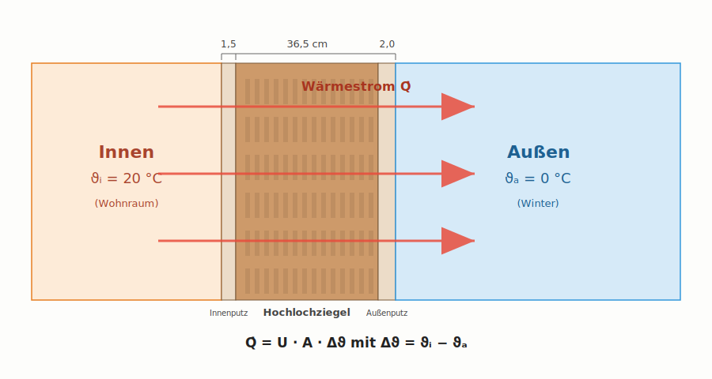

# Wärmedurchgang durch Bauteile

Wenn Familie Schmitt im Winter heizt und es draußen kalt ist, fließt **ständig Wärme nach außen** – durch jede Wand, jedes Fenster, jede Tür, das Dach und den Keller. Diese Wärme muss die Heizung permanent ersetzen. Je besser ein Bauteil dämmt, desto weniger Wärme geht verloren.

In diesem Kapitel lernen wir die drei Größen kennen, mit denen wir den Wärmedurchgang quantitativ beschreiben: $\lambda$, $R$ und $U$.

!!! abstract "Lernziele"
    Nach diesem Kapitel könnt ihr
    
    - die Wärmeleitfähigkeit λ definieren und typische Werte für Baustoffe einordnen,
    - den Wärmedurchlasswiderstand R einer Schicht berechnen,
    - den U-Wert eines mehrschichtigen Bauteils per Hand bestimmen,
    - die Wärmeübergangswiderstände innen und außen anwenden.

## Worum geht es?

{ width="700" }

Innen ist es 20 °C warm, außen 0 °C kalt. Die Temperaturdifferenz ist die **Triebkraft** für den Wärmestrom: Wärme will immer von warm nach kalt fließen. Die Wand bremst diesen Strom – aber sie hält ihn nicht auf. Wie viel Wärme pro Sekunde durch jeden Quadratmeter Wandfläche fließt, hängt ab von

- der Temperaturdifferenz $\Delta\vartheta$,
- der Bauart der Wand (Material, Dicke).

Diesen Zusammenhang beschreibt der **U-Wert**:

$$
\dot{Q} = U \cdot A \cdot \Delta\vartheta
$$

mit

- $\dot{Q}$ – Wärmestrom in Watt (W)
- $U$ – Wärmedurchgangskoeffizient in W/(m²·K)
- $A$ – Bauteilfläche in m²
- $\Delta\vartheta$ – Temperaturdifferenz in K

!!! tip "Anschauliche Bedeutung des U-Werts"
    Der U-Wert sagt uns: Bei einem Quadratmeter Wand und einem Grad Temperaturunterschied fließen genau **U Watt** Wärme nach außen.
    
    *Beispiel:* Eine Wand mit U = 0,5 W/(m²·K), 10 m² Fläche, Innen 20 °C, Außen 0 °C: 
    
    $\dot{Q} = 0{,}5 \cdot 10 \cdot 20 = 100$ W. Das entspricht einer dauerhaft brennenden 100-W-Glühbirne, die an dieser Wand permanent als Verlustleistung anfällt.

Je **kleiner** der U-Wert, desto **besser** dämmt das Bauteil. Eine ungedämmte Außenwand aus Vollziegel hat etwa U = 1,5 W/(m²·K), eine gut gedämmte Wand U = 0,2 W/(m²·K) oder weniger. Das ist ein Faktor 7,5 – und dieser Faktor fließt 1:1 in die Heizkosten ein.

## Die drei Größen: λ, R und U

Der U-Wert ergibt sich nicht aus dem Nichts – er wird aus den Eigenschaften der einzelnen Wandschichten berechnet. Drei physikalische Größen sind dabei wichtig.

### Wärmeleitfähigkeit λ

Die **Wärmeleitfähigkeit** $\lambda$ (sprich: lambda) ist eine Materialeigenschaft. Sie beschreibt, wie gut ein Stoff Wärme leitet:

$$
\lambda \quad \text{in } \frac{\text{W}}{\text{m} \cdot \text{K}}
$$

| Material | λ in W/(m·K) | Bewertung |
|---|---|---|
| Stahlbeton | 2,3 | leitet Wärme sehr gut ⇒ schlechter Dämmstoff |
| Vollziegel | 0,80 | leitet gut |
| Hochlochziegel (1970er) | 0,40–0,50 | leitet mäßig |
| Holz (Nadelholz) | 0,13 | leitet schlecht ⇒ schon dämmend |
| Mineralwolle | 0,032–0,040 | leitet sehr schlecht ⇒ guter Dämmstoff |
| EPS (Polystyrol) | 0,031–0,040 | sehr guter Dämmstoff |
| Luft (ruhend) | 0,025 | bester natürlicher Dämmstoff |

!!! info "Merkregel"
    Ein Dämmstoff funktioniert nur deshalb so gut, weil er **viel ruhende Luft** in kleinen Poren einschließt. Mineralwolle, EPS und Schaumglas sind im Grunde "Tricks", um Luft am Strömen zu hindern.

### Wärmedurchlasswiderstand R

Der **Wärmedurchlasswiderstand** $R$ einer einzelnen Schicht hängt von ihrer **Dicke** $d$ und ihrer **Wärmeleitfähigkeit** $\lambda$ ab:

$$
R = \frac{d}{\lambda} \quad \text{in } \frac{\text{m}^2 \cdot \text{K}}{\text{W}}
$$

Anschaulich: Je dicker die Schicht und je schlechter sie Wärme leitet, desto höher ist ihr Widerstand. Liegen mehrere Schichten **in Reihe** (also hintereinander), addieren sich ihre Widerstände einfach:

$$
R_{ges} = R_1 + R_2 + R_3 + \ldots
$$

!!! example "Beispiel: 16 cm Mineralwolle"
    $d = 0{,}16$ m, $\lambda = 0{,}035$ W/(m·K)
    
    $R = \dfrac{0{,}16}{0{,}035} = 4{,}57 \, \dfrac{\text{m}^2 \cdot \text{K}}{\text{W}}$
    
    Das ist ein hoher Widerstand. Allein diese Schicht würde den U-Wert auf etwa 0,21 W/(m²·K) drücken.

### Wärmeübergangswiderstände Rsi und Rse

An der Bauteilgrenze geht die Wärme nicht direkt durch eine Schicht, sondern muss erst von der Raumluft auf die Wandoberfläche übergehen (innen) bzw. von der Wandoberfläche an die Außenluft abgegeben werden (außen). Diese Vorgänge fasst man im **Wärmeübergangswiderstand** zusammen:

| Bauteil | $R_{si}$ (innen) | $R_{se}$ (außen) |
|---|---|---|
| Wand | 0,13 | 0,04 |
| Dach (Wärmestrom nach oben) | 0,10 | 0,04 |
| Bodenplatte (Wärmestrom nach unten) | 0,17 | 0,04 |

(Werte in m²·K/W nach DIN EN ISO 6946)

Diese Widerstände sind klein, aber sie zählen mit. Vor allem bei sehr gut gedämmten Bauteilen sind sie nicht mehr vernachlässigbar.

### Der U-Wert als Kehrwert

Schließlich ist der U-Wert einfach der **Kehrwert der Summe aller Widerstände**:

$$
U = \dfrac{1}{R_{si} + \displaystyle\sum_{i} \dfrac{d_i}{\lambda_i} + R_{se}}
$$

Diese Formel ist das **Werkzeug**, mit dem wir jeden geschichteten Bauteilaufbau berechnen können – auch den sanierten und unsanierten Zustand bei Familie Schmitt.

## Tabellarisches Vorgehen

Die saubere Form der Berechnung ist die **Schichten-Tabelle**: jede Schicht in eine Zeile, am Ende die Summe und der U-Wert.

| Schicht | $d$ in m | $\lambda$ in W/(m·K) | $R = d / \lambda$ in m²·K/W |
|---|---|---|---|
| (innen) | – | – | $R_{si} = 0{,}13$ |
| Schicht 1 | $d_1$ | $\lambda_1$ | $R_1$ |
| Schicht 2 | $d_2$ | $\lambda_2$ | $R_2$ |
| ... | ... | ... | ... |
| (außen) | – | – | $R_{se} = 0{,}04$ |
| **Summe** | | | $R_{ges}$ |

und dann $U = 1 / R_{ges}$.

Dieses Schema werdet ihr für jede U-Wert-Berechnung verwenden. Es zwingt euch zur Sauberkeit, macht Fehler leicht erkennbar und ist die Form, die in der Technikerprüfung erwartet wird.

## Verständnis-Check

Was beschreibt die Wärmeleitfähigkeit λ?

<ul class="quiz__opts">
<li>Eine Eigenschaft des gesamten Bauteils – sie hängt also vom Schichtaufbau ab.</li>
<li>Eine reine Materialeigenschaft – unabhängig von Schichtdicke und Bauteilaufbau.</li>
<li>Eine Eigenschaft einer einzelnen Schicht – sie hängt von Material und Dicke ab.</li>
<li>Den Wärmewiderstand pro Kelvin Temperaturdifferenz.</li>
</ul>

λ ist eine reine <strong>Materialeigenschaft</strong>. Wenn du zusätzlich die Schichtdicke berücksichtigst, kommst du zum Wärmedurchlasswiderstand R (Schichteigenschaft). Erst die Summe aller R-Werte plus Übergangswiderstände ergibt den U-Wert (Bauteileigenschaft).

Welcher der folgenden Stoffe ist der beste Dämmstoff?

<ul class="quiz__opts">
<li>Stahlbeton mit λ = 2,3 W/(m·K)</li>
<li>Vollziegel mit λ = 0,80 W/(m·K)</li>
<li>Mineralwolle mit λ = 0,035 W/(m·K)</li>
<li>Holz mit λ = 0,13 W/(m·K)</li>
</ul>

Je <strong>kleiner</strong> der λ-Wert, desto besser die Dämmwirkung – denn ein Material mit kleinem λ leitet Wärme schlecht. Mineralwolle ist hier mit Abstand der beste Dämmstoff. Holz ist auch dämmend, aber etwa 4× schlechter als Mineralwolle.

Eine Dämmschicht mit λ = 0,035 ist 8 cm dick. Wie verändert sich der R-Wert, wenn wir die Dicke auf 16 cm verdoppeln?

<ul class="quiz__opts">
<li>Der R-Wert bleibt gleich – λ ist die maßgebliche Größe.</li>
<li>Der R-Wert verdoppelt sich, weil R = d / λ.</li>
<li>Der R-Wert vervierfacht sich, weil er quadratisch von der Dicke abhängt.</li>
<li>Der R-Wert halbiert sich.</li>
</ul>

R = d / λ ist eine <strong>lineare</strong> Beziehung. Doppelte Dicke = doppelter Widerstand. Wichtig: Der U-Wert verändert sich nicht ganz linear, weil noch die übrigen Schichten und Übergangswiderstände hinzukommen – der Effekt zusätzlicher Dämmung wird mit steigender Dicke geringer.

Welche Wand dämmt besser: U = 0,2 oder U = 0,5 W/(m²·K)?

<ul class="quiz__opts">
<li>U = 0,2 dämmt besser – ein kleiner U-Wert bedeutet wenig Wärmestrom.</li>
<li>U = 0,5 dämmt besser – ein größerer U-Wert bedeutet höhere Dämmwirkung.</li>
<li>Beide dämmen gleich gut – der U-Wert sagt nichts über die Dämmwirkung aus.</li>
<li>Das hängt vom Bauteilaufbau ab – aus dem U-Wert allein lässt sich keine Aussage treffen.</li>
</ul>

Bei einer Wand mit U = 0,2 fließen pro m² und Kelvin nur 0,2 W ab – bei U = 0,5 sind es 0,5 W. <strong>Je kleiner U, desto besser die Dämmung.</strong> Im Vergleich der Bestandswand (U = 0,92) zur sanierten (U = 0,18) sieht man, was Dämmung quantitativ bringt.

Welche Aussage über Wärmeübergangswiderstände (Rsi, Rse) ist richtig?

<ul class="quiz__opts">
<li>Sie spielen nur bei Bauteilen mit Erdkontakt eine Rolle.</li>
<li>Sie sind so klein, dass man sie in der Praxis vernachlässigen kann.</li>
<li>Sie beschreiben den Wärmeübergang zwischen Luft und Wandoberfläche und gehören in jede U-Wert-Berechnung.</li>
<li>Sie ersetzen die R-Werte der einzelnen Schichten.</li>
</ul>

Die Wärmeübergangswiderstände beschreiben die <strong>Grenzschicht zwischen Luft und Bauteil</strong>. Innen ist diese stehende Luftschicht dicker und träger (Rsi = 0,13), außen sorgt der Wind für intensiveren Austausch (Rse = 0,04). Sie sind klein, aber zählen mit – besonders bei sehr gut gedämmten Bauteilen werden sie relativ wichtiger.

Eine Außenwand soll mit einer 0,5 cm dicken Putzschicht versehen werden (λ = 0,87). Wie wirkt sich das auf den U-Wert aus?

<ul class="quiz__opts">
<li>Der U-Wert verdoppelt sich, weil eine zusätzliche Schicht hinzukommt.</li>
<li>Der U-Wert sinkt deutlich – jede zusätzliche Schicht dämmt zusätzlich.</li>
<li>Der U-Wert bleibt unverändert – Putz hat keinen Einfluss.</li>
<li>Der U-Wert sinkt nur minimal – R = 0,005 / 0,87 ≈ 0,006 m²·K/W ist sehr klein gegenüber den anderen Schichten.</li>
</ul>

Ein Material mit hohem λ und kleiner Dicke trägt nur einen sehr kleinen R-Wert bei. Putz dämmt also kaum. Erst dicke Schichten mit kleinem λ – wie 16 cm EPS mit λ = 0,035 (R ≈ 4,57!) – machen einen spürbaren Unterschied.

Ein Bauteil hat U = 0,4 W/(m²·K) und eine Fläche von 50 m². Innen 20 °C, außen 0 °C. Wie groß ist der Wärmestrom?

<ul class="quiz__opts">
<li>200 W</li>
<li>400 W</li>
<li>800 W</li>
<li>4 000 W</li>
</ul>

Q̇ = U · A · ΔT = 0,4 · 50 · 20 = <strong>400 W</strong>. Diese Formel ist das Arbeitspferd jeder energetischen Berechnung – ein Wärmestrom von 400 W entspricht etwa der dauerhaften Leistung von vier 100-W-Glühbirnen.

## Was wir gleich tun

Im nächsten Kapitel berechnen wir damit den **U-Wert der Außenwand bei Familie Schmitt** – einmal im Bestand (36,5 cm Hochlochziegel mit Putz innen und außen) und einmal nach Sanierung mit einem Wärmedämmverbundsystem. Dann werden wir konkret sehen, was 16 cm zusätzliche Dämmung bewirken.

## Im Unterricht besprechen

Reflexion

Welche der drei Größen λ, R und U war für dich am Anfang am unklarsten – und wie würdest du sie jetzt einer fachfremden Person (z. B. einer Verwandten) in zwei Sätzen erklären?

Diskussion

In Bestandsgebäuden trifft man manchmal auf alte Sandstein- oder Klinkerbauten mit 60 cm dicken Vollziegelwänden (λ ≈ 0,80). Diese gelten oft als „solide" und „warm". Wie schneiden sie tatsächlich gegen eine moderne 24-cm-Wand mit 16-cm-WDVS ab? Wo liegen die <em>energetischen</em>, wo die <em>baukulturellen</em> Argumente?

Schätzt die U-Werte beider Wände grob ab. Wo überrascht euch das Ergebnis?

Diskussion

Eine Hausbesitzerin sagt im Beratungsgespräch: „Aber Holz ist doch ein <em>natürlicher</em> Dämmstoff – das muss doch besser dämmen als so chemische Sachen wie Polystyrol." Wie reagiert ihr fachlich, ohne die Kundin zu belehren?

Nutzt die λ-Tabelle als Argumentationsgrundlage – und überlegt euch, welche anderen Kriterien (graue Energie, Brandschutz, Kosten) trotzdem für Holzfaserdämmung sprechen können.

→ Weiter zu [U-Wert von Bauteilen berechnen](../berechnungen/u-wert-bauteil.md)
