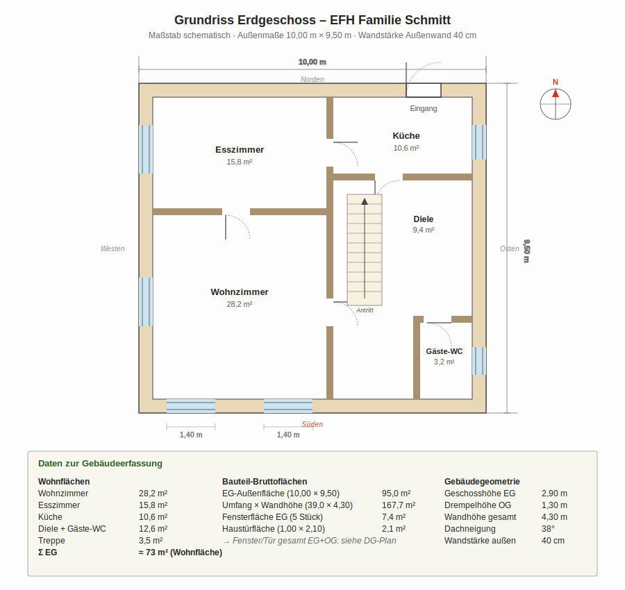
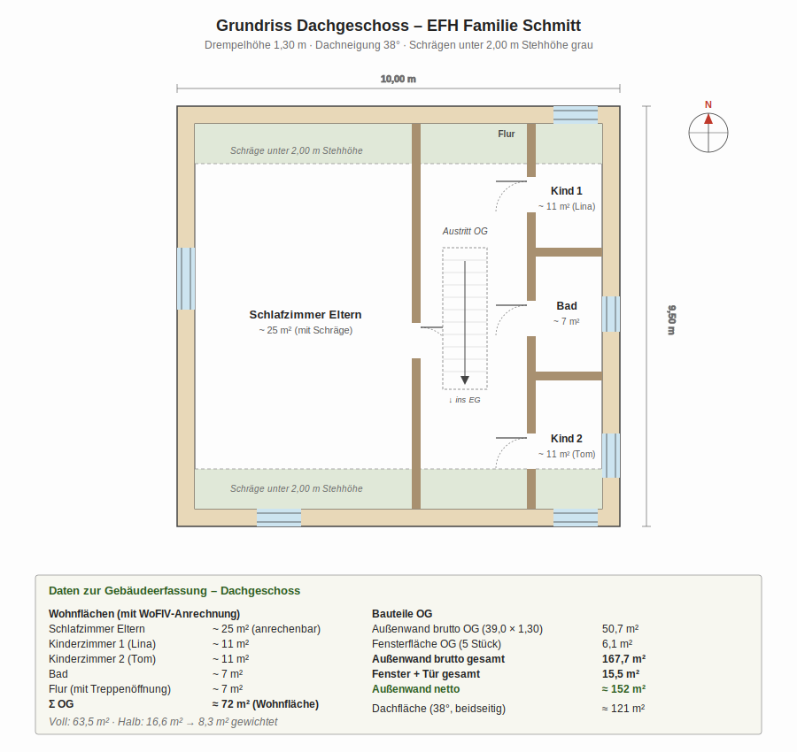
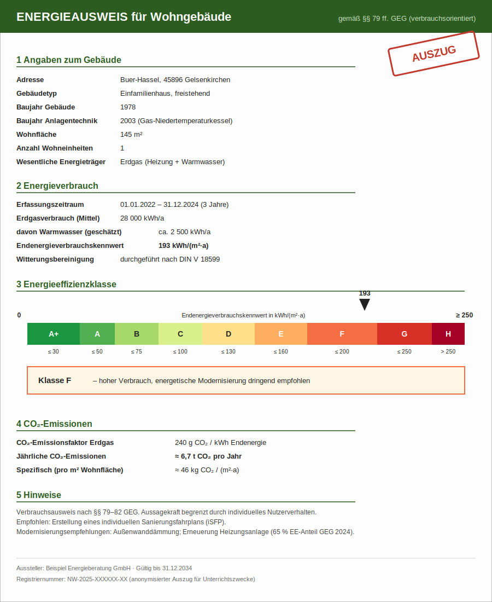

# Lernsituation: Familie Schmitt in Gelsenkirchen

## Die Familie

Familie Schmitt lebt seit zwölf Jahren in einem freistehenden Einfamilienhaus in **Gelsenkirchen-Buer-Hassel**. Das Haus haben sie 2014 von Markus' Eltern übernommen, die es seit dem Bau bewohnt hatten.

- **Anna Schmitt (39)**, kaufmännische Angestellte
- **Markus Schmitt (42)**, IT-Administrator
- **Lina (10)** und **Tom (7)**, beide Grundschule

Die Familie plant, langfristig im Haus wohnen zu bleiben. Ein Erbfall im letzten Jahr macht eine größere Investition möglich.

## Das Gebäude

!!! info "Eckdaten"
    - **Baujahr:** 1978 (errichtet nach 1. Wärmeschutzverordnung von 1977, vor der 2. WSchVO 1984)
    - **Wohnfläche:** 145 m², 1,5-geschossig mit ausgebautem Satteldach
    - **Vollunterkellert**
    - **Standort:** Gelsenkirchen-Buer-Hassel, Klimazone NRW
    - **Heizung:** Gas-Niedertemperaturkessel von 2003

### Bauteile im Bestand

| Bauteil | Aufbau | U-Wert (W/m²K) |
|---|---|---|
| Außenwand | 36,5 cm Hochlochziegel + Putz innen/außen | ≈ 0,92 |
| Dach (Sparrendach) | 1995 nachträglich mit 12 cm Mineralwolle zwischen 16 cm Sparren gedämmt | ≈ 0,32 |
| Fenster | 1995 erneuert: Zweifach-Isolierverglasung, unbeschichtet | U_w ≈ 2,8 |
| Kellerdecke | Stahlbeton, ungedämmt | ≈ 1,1 |

### Grundrisse

Die Energieberaterin hat die Bestandspläne aus dem Bauantrag von 1978 digitalisiert. Aus diesen Plänen ermitteln wir später die genauen Bauteilflächen.

#### Erdgeschoss

{ width="850" }

#### Dachgeschoss

{ width="850" }

### Energieausweis

Familie Schmitt besitzt einen **verbrauchsorientierten Energieausweis** aus dem Jahr 2024, erstellt im Rahmen einer früheren Beratung. Die Daten basieren auf den Heizkostenabrechnungen von 2022 bis 2024.

{ width="850" }

## Erste Aufgabe: Bestandsaufnahme

Bevor wir mit den Berechnungen beginnen, müssen wir aus den vorhandenen Unterlagen alle wichtigen Daten zusammenstellen. **Das ist die typische erste Tätigkeit einer Energieberatung.**

!!! example "Aufgabe 1 – Datenerfassung aus Plänen und Energieausweis"
    Lest die Grundrisse und den Energieausweis sorgfältig durch und tragt die folgenden Werte in eine Tabelle ein:
    
    **Aus dem Energieausweis:**
    
    a) Endenergieverbrauchskennwert in kWh/(m²·a)
    b) Energieeffizienzklasse  
    c) Jährlicher Erdgasverbrauch in kWh
    d) Anteil Warmwasser-Erzeugung in kWh/a  
    e) Jährliche CO₂-Emissionen in t/a  
    f) CO₂-Emissionsfaktor für Erdgas in g/kWh  
    
    **Aus den Grundrissen:**
    
    g) Außenmaße des Gebäudes (L × B)  
    h) Wandhöhe gesamt (EG + Drempel)  
    i) Außenwand brutto in m² (Berechnung)  
    j) Fenster + Tür gesamt in m²  
    k) Außenwand netto in m² (Berechnung)  
    l) EG-Außenfläche in m² (= Kellerdecke)  
    m) Dachfläche in m² (bei 38°)  

??? success "Lösung Aufgabe 1"
    
    | Aus Energieausweis | Wert |
    |---|---|
    | a) Endenergieverbrauchskennwert | 193 kWh/(m²·a) |
    | b) Energieeffizienzklasse | F |
    | c) Erdgasverbrauch | 28 000 kWh/a |
    | d) Anteil Warmwasser | ca. 2 500 kWh/a |
    | e) CO₂-Emissionen | ≈ 6,7 t/a |
    | f) CO₂-Faktor Erdgas | 240 g/kWh |
    
    | Aus Grundrissen | Wert |
    |---|---|
    | g) Außenmaße | 10,00 m × 9,50 m |
    | h) Wandhöhe gesamt | 4,30 m (= 2,90 + 1,30 + 0,10) |
    | i) Außenwand brutto | 39,00 × 4,30 = 167,7 m² |
    | j) Fenster + Tür | 13,4 + 2,1 = 15,5 m² |
    | k) Außenwand netto | 167,7 − 15,5 = 152 m² |
    | l) EG-Außenfläche (= Kellerdecke) | 95 m² |
    | m) Dachfläche bei 38° | ≈ 121 m² |
    
    Diese Werte werden wir in den nächsten Stunden für Berechnungen heranziehen.

### Energieverbrauch im Bestand – Einordnung

Die Daten aus dem Energieausweis ergeben:

- Endenergieverbrauch ca. **28 000 kWh Erdgas pro Jahr**
- Spezifisch: rund **193 kWh/(m²·a)** → **Energieeffizienzklasse F**
- Gaskosten 2025: etwa **3 100 € pro Jahr** (bei 11,2 ct/kWh inkl. Grundgebühr)
- CO₂-Emissionen: **rund 6,7 Tonnen pro Jahr**

Die Klasse F bedeutet: Das Haus liegt **deutlich über dem Durchschnitt** an Energieverbrauch. Ein gut saniertes Bestandsgebäude erreicht Klasse C oder D, ein moderner Neubau Klasse A oder besser.

## Der Anlass

Im Februar fällt der Heizkessel zum dritten Mal in dieser Heizperiode aus. Der Heizungsbauer rät zu einer Erneuerung – „mit der Anlage werden Sie nicht mehr glücklich". Anna Schmitt liest sich ein und erfährt: Eine **Wärmepumpe** könnte sinnvoll sein – aber nur, wenn das Haus dafür energetisch fit ist.

Die Schmitts vereinbaren einen Termin mit einer Energieberaterin. Die schaut sich das Haus an und sagt einen Satz, der die Familie zunächst überrascht:

!!! quote ""
    *„Lassen Sie uns über die neue Heizung reden, **nachdem** wir über Ihre Außenwände gesprochen haben."*

## Eure Rolle

Ihr seid Mitarbeiter:innen im Ingenieurbüro der Energieberaterin und sollt die Sanierungsplanung für Familie Schmitt vorbereiten. Eure Aufgabe ist, die fachlichen Grundlagen zu erarbeiten, die anschließende Beratung mit belastbaren Berechnungen zu untermauern und eine begründete Empfehlung zu formulieren, die die Energieberaterin mit der Familie besprechen kann.

### Phase 1 – Fokus Außenwand

In Phase 1 konzentrieren wir uns auf die **Außenwanddämmung mit einem Wärmedämmverbundsystem (WDVS)**. Eure Arbeitsschritte:

1. die bauphysikalischen Grundlagen verstehen, die hinter der Empfehlung stehen
2. den **U-Wert vor und nach der Sanierung** berechnen
3. die **jährliche Energieeinsparung** bestimmen
4. die **Wirtschaftlichkeit** (Investition, Förderung, Amortisation) bewerten
5. die **CO₂-Einsparung** ermitteln
6. eine begründete Empfehlung formulieren

### Phase 2 – Ganzheitliche Sanierung

Aufbauend weiten wir den Blick auf Dach, Fenster, Keller und Anlagentechnik aus und vergleichen verschiedene Sanierungsstrategien gegeneinander.

## Warum gerade dieses Haus?

Familie Schmitts Haus steht stellvertretend für einen **typischen Sanierungsfall im Ruhrgebiet**:

- gebaut in den späten 1970er Jahren mit damaligem Stand der Technik
- in den 1990er Jahren teilsaniert, aber nur an einzelnen Bauteilen
- die heute schwächste Stelle (Außenwand) ist gleichzeitig die mit der größten Fläche
- klassischer Auslöser für die Beratung: **defekte Heizung**, nicht der Wunsch nach Sanierung

Wer diesen Fall sicher rechnen, bewerten und beraten kann, kann es auch bei den meisten anderen Bestandsgebäuden dieser Bauepoche.

## Im Unterricht besprechen

Reflexion

Der Energieausweis zeigt Klasse F, der Heizverbrauch liegt deutlich über dem Bundesdurchschnitt. Was würdet ihr an Familie Schmitts Stelle <em>als Erstes</em> tun – nur den Heizkessel ersetzen, eine umfassende Beratung beauftragen, oder sofort eine Komplettsanierung planen? Begründet eure spontane Bauchentscheidung.

Die Antwort verändert sich oft im Lauf des Kurses – haltet eure jetzige Einschätzung fest, wir kommen am Ende darauf zurück.

Diskussion

Der Anlass für die Beratung ist eine <strong>defekte Heizung</strong>. Welche Personen außer der Familie sind in einem solchen Fall an der Entscheidung beteiligt – und welche Interessen könnten kollidieren?

Denkt an: Heizungsbauer, Energieberaterin, Architektin, Bank, Kommune, Nachbarn. Wer hat welches Interesse an welcher Lösung?

---

→ Weiter zu den [Grundlagen: Wärmedurchgang](../grundlagen/waermedurchgang.md)
